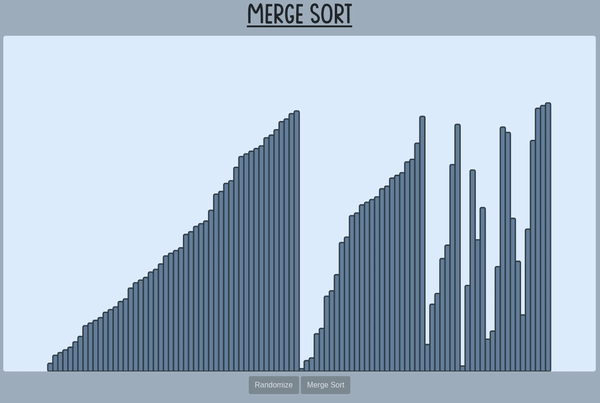
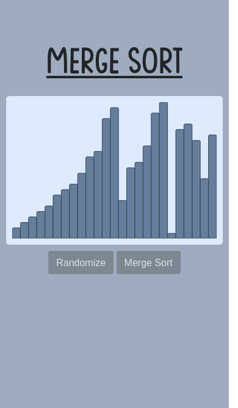

# Merge Sort Visualizer

## Table of contents
* [Overview](#overview)
* [Examples](#examples)
* [Technologies](#technologies)
* [Setup](#setup)
* [Limitations](#limitations)

## Overview
This project is a website that visualizes the steps of a merge sort. The algorithm sorts columns of differing heights in ascending order. The initial order of the columns is random and can be randomized when the merge sort is not running. This program can help to understand the steps the merge sort algorithm takes.

## Examples

> Recording of the sorting animation on desktop

> Screenshot on mobile during the sort animation

## Technologies
- **HTML / CSS**
- **JavaScript**
- **Bootstrap 4.5**

## Usage
Find the game [here](https://alex0blackwell.github.io/pages/merge/) or at the *portfolio* section of my [website](https://alex0blackwell.github.io/).

## Limitations
- [ ] No sorting algorithms other than merge sort

## License
Licensed under the [GNU General Public License v3.0](LICENSE)
